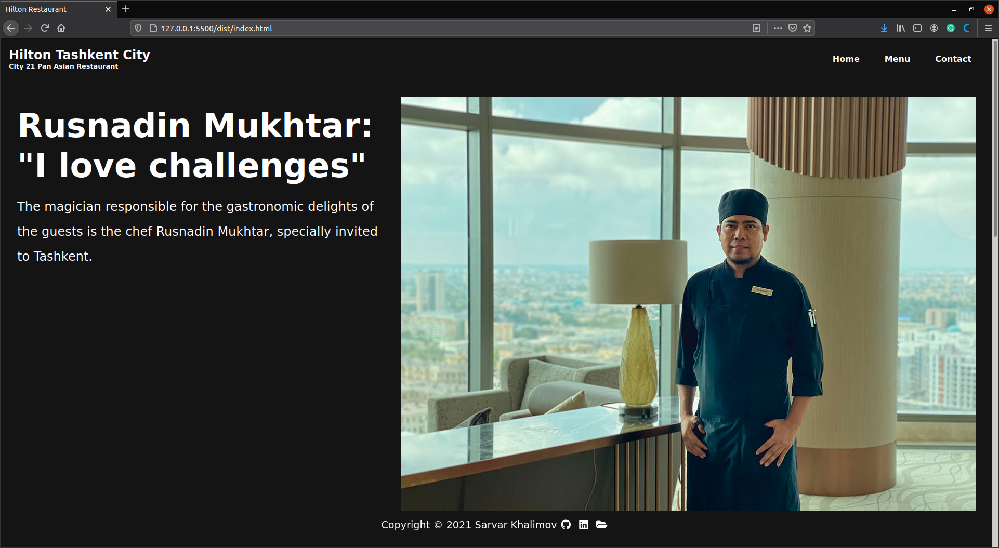

# Restaurant page - Hilton Tashkent City

> A simple restaurant homepage dynamically rendered in JavaScript using the Webpack. Personnaly Custumized for [City 21 Pan Asian  Restaurant](https://www.facebook.com/City21restaurant/) located in [Hilton Tashkent City](https://www.hilton.com/en/hotels/tastchi-hilton-tashkent-city/dining/).

  
  

> A restaurant page is part of Full-Stack JavaScript Curriculum in the [the Odin Project’s](https://www.theodinproject.com/paths/full-stack-javascript/courses/javascript/lessons/restaurant-page).

## Built With

- JavaScript
- Webpack
- CSS

## Live Demo

[Live Demo Link](https://hilton-tashkent-city-restaurant.netlify.app/)

## Getting Started

To get a local copy up and running follow these simple example steps.

### Setup
    Step 1: git clone https://github.com/SarvarKh/books-library-js.git
    
    Step 2: open live-server

## Authors

👤 **Sarvar Khalimov**

- GitHub: [@SarvarKh](https://github.com/SarvarKh)
- Twitter: [@KhalimovSarvar](https://twitter.com/KhalimovSarvar)
- LinkedIn: [LinkedIn](https://www.linkedin.com/in/sarvar-khalimov)

## 🤝 Contributing

Contributions, issues, and feature requests are welcome!

Feel free to check the [issues page](https://github.com/SarvarKh/Restaurant-page/issues).

## Show your support

Give a ⭐️ if you like this project!

## 📝 License

This project is [MIT](./MIT.md) licensed.
